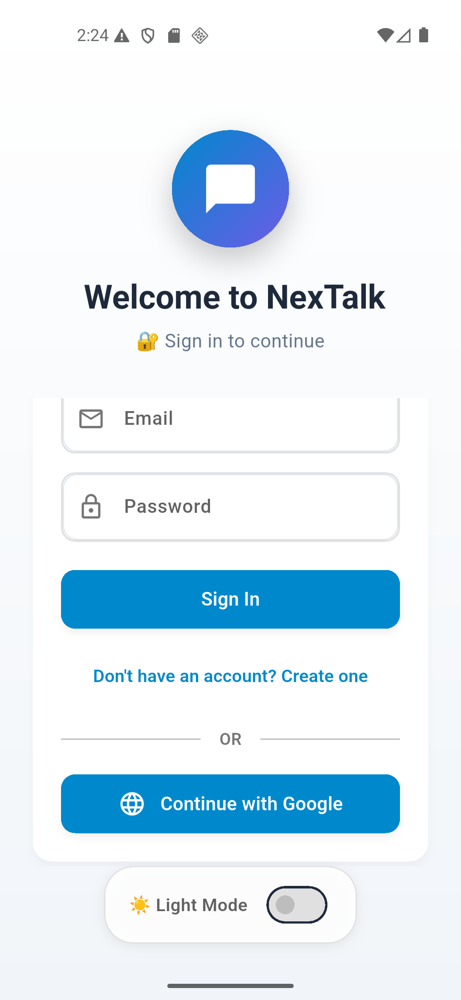
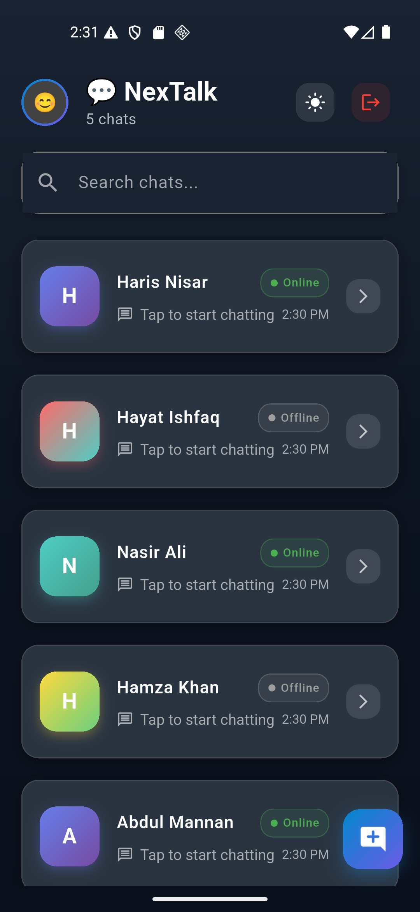
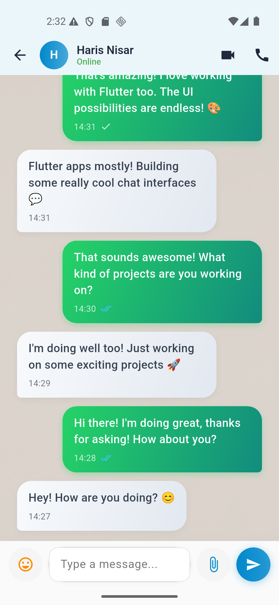
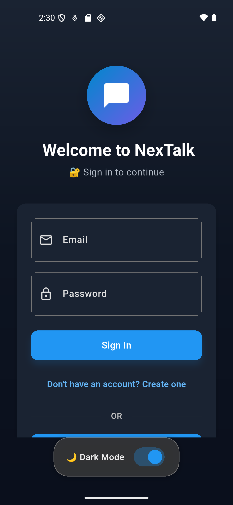

# 💬 NexTalk – Modern Flutter Chat Application

## 🚀 Project Overview

**NexTalk** is a modern messaging application built with **Flutter** and **Firebase**, featuring dual authentication methods (email/password + Google Sign-In), real-time chat capabilities, WhatsApp-style UI with gradient themes, and MVVM architecture. It delivers a professional messaging experience with Material Design 3 components and seamless dark/light mode switching.

---

## 🌟 Features

- 🔐 **Dual Authentication** - Email/Password and Google Sign-In integration
- 💬 **Real-Time Messaging** - Instant chat with WhatsApp-style message bubbles
- 🎨 **Dynamic Theming** - Beautiful gradient themes with dark/light mode toggle
- 🔍 **Advanced Search** - Find users and conversations instantly
- 🏗️ **MVVM Architecture** - Clean, scalable code structure with Provider state management
- 📱 **Material Design 3** - Modern UI components with smooth animations
- 🔔 **Push Notifications** - Firebase Cloud Messaging integration
- 🌐 **Cross-Platform** - Native performance on Android and iOS

---

## 📱 Screenshots

| Login Screen | Chat List | Chat Detail | Dark Theme |
|--------------|-----------|-------------|--------------|
|  |  |  |  |

---

## 📂 Project Structure
```
lib/
│
├── main.dart                           # Application entry point
├── models/
│   ├── user_model.dart                # User data model
│   └── message_model.dart             # Message data model
├── services/
│   ├── auth_service.dart              # Firebase authentication service
│   └── chat_service.dart              # Chat and messaging service
├── viewmodels/
│   ├── auth_viewmodel.dart            # Authentication business logic
│   ├── chat_list_viewmodel.dart       # Chat list state management
│   ├── chat_detail_viewmodel.dart     # Chat detail state management
│   └── theme_provider.dart            # Theme state management
├── views/
│   ├── splash_screen.dart             # App splash screen
│   ├── login_screen.dart              # Authentication screen
│   ├── chat_list_screen.dart          # Main chat list screen
│   └── chat_detail_screen.dart        # Individual chat screen
├── widgets/
│   ├── message_bubble.dart            # WhatsApp-style message bubbles
│   ├── user_tile.dart                 # User list tile widget
│   └── loading_indicator.dart         # Custom loading widget
└── utils/
    └── theme.dart                     # App theme configuration
```

---

## 🧠 Skills Demonstrated

- 🏛️ **MVVM Architecture** - Clean separation of concerns with Model-View-ViewModel pattern
- 🔥 **Firebase Integration** - Authentication, Realtime Database, and Cloud Messaging
- 📊 **State Management** - Efficient Provider pattern implementation
- 🎨 **Custom UI Design** - Material Design 3 with gradient themes and animations
- 🔐 **Security** - Multi-factor authentication and secure data handling
- ⚡ **Performance** - Optimized list rendering and efficient state updates
- 🧪 **Code Quality** - Maintainable, scalable, and well-documented codebase

---

## 🛠 Technologies Used

- **Flutter** (Dart) - Cross-platform mobile development framework
- **Firebase** - Authentication, Realtime Database, Cloud Messaging
- **Provider** - State management solution
- **Material Design 3** - Modern UI components and design system
- **Google Sign-In** - OAuth integration for seamless authentication

---

## 🚀 Getting Started

### Prerequisites
- Flutter SDK (version 3.8.1 or higher)
- Dart SDK (included with Flutter)
- VS Code or Android Studio with Flutter plugin
- Firebase project (with Authentication and Realtime Database enabled)

### Installation
1. **Clone the repository**
   ```bash
   git clone https://github.com/M-Attaullah/Chat-App.git
   cd Chat-App
   ```
   
2. **Install dependencies**
   ```bash
   flutter pub get
   ```

3. **Configure Firebase**
   - Add your `google-services.json` (Android) and `GoogleService-Info.plist` (iOS) to the respective platform folders.
   - Enable Email/Password authentication in Firebase Console.
   - Set up Realtime Database with appropriate security rules

4. **Run the app**
   ```bash
   flutter run
   ```

---

## 📦 Dependencies

```yaml
dependencies:
  flutter:
    sdk: flutter
  firebase_core: ^2.30.0              # Firebase core functionality
  firebase_auth: ^4.17.8              # Firebase authentication
  firebase_database: ^10.4.8          # Realtime database
  firebase_messaging: ^14.7.20        # Push notifications
  google_sign_in: ^6.2.1              # Google Sign-In integration
  provider: ^6.1.2                    # State management
  connectivity_plus: ^5.0.2           # Network connectivity
  flutter_local_notifications: ^17.0.0 # Local notifications
  intl: ^0.19.0                       # Internationalization
  uuid: ^4.3.3                        # Unique ID generation
```

---

## 🎯 Future Enhancements

- [ ] 📸 Media sharing (images, videos)
- [ ] 👥 Group chat functionality
- [ ] 🎵 Voice message support
- [ ] 📍 Location sharing
- [ ] 🔔 Custom notification settings
- [ ] 📊 Message read receipts
- [ ] 🌍 Multi-language support
- [ ] 🔒 End-to-end encryption


